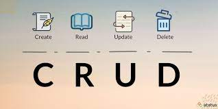

<a name="readme-top"></a>

<!-- PROJECT LOGO -->
<br />
<div align="center">
  <a href="https://github.com/matte97p/CRUD">
    
  </a>

  <h3 align="center">SimplyCrud</h3>
  
  Creare un micro servizio in Laravel API centrico che gestisca un CRUD completo e con la lista di elementi paginati
</div>

<!-- TABLE OF CONTENTS -->
<details>
  <summary>Table of Contents</summary>
  <ol>
    <li><a href="#built-with">Built With</a></li>
    <li>
      <a href="#getting-started">Getting Started</a>
      <ul>
        <li><a href="#prerequisites">Prerequisites</a></li>
        <li><a href="#installation">Installation</a></li>
      </ul>
    </li>
    <li><a href="#coding-guidelines">Coding Guidelines</a></li>
    <li><a href="#thunder-collenction">Thunder Collenction</a></li>
  </ol>
</details>

<!-- BUILT WITH -->

### Built With

<!---   [![Angular][angular.io]][angular-docs]-->
-   [![Laravel][laravel.com]][laravel-docs]

<p align="right">(<a href="#readme-top">back to top</a>)</p>

<!-- GETTING STARTED -->

## Getting Started

### Prerequisites

-   [PostgreSQL][postgresql-download]
-   [php8.2][php8.2-download]
-   [composer][composer-download]
    ```sh
    php -r "copy('https://getcomposer.org/installer', 'composer-setup.php');"
    php -r "if (hash_file('sha384', 'composer-setup.php') === '55ce33d7678c5a611085589f1f3ddf8b3c52d662cd01d4ba75c0ee0459970c2200a51f492d557530c71c15d8dba01eae') { echo 'Installer verified'; } else { echo 'Installer corrupt'; unlink('composer-setup.php'); } echo PHP_EOL;"
    php composer-setup.php
    php -r "unlink('composer-setup.php');"
    ```
-   [Laravel10][laravel10-download]
    ```sh
    composer global require laravel/installer
    ```
-   [Laravel Passport][laravel-passport-docs] -> provides a full OAuth2 server implementation
    ```sh
    composer require laravel/passport
    php artisan passport:install
    ```
-   optional [Laravel Valet][laravel-valet-docs] -> blazing fast Laravel development environment that uses roughly 7 MB of RAM
    ```sh
    composer global require laravel/valet
    valet install
    cd ~/Sites
    valet park
    ```
-   optional [Laravel Telescope][laravel-telescope-docs] -> Telescope provides insight into the requests coming into your application and more.
    ```sh
    composer require laravel/telescope
    php artisan telescope:install
    ```
-   optional [Laravel Horizon][laravel-horizon-docs] -> dashboard Redis queues
    ```sh
    composer require laravel/horizon
    php artisan horizon:install
    ```

### Installation

1. Clone the repo
    ```sh
    git clone https://github.com/matte97p/CRUD.git
    ```
2. Install packages
    ```sh
    composer install
    ```
3. Create DB and upload [DB Backup][DB_DUMP]
    ```sh
    sudo -u postgres psql
    CREATE DATABASE wefox;
    CREATE USER mario with PASSWORD 'rossi';
    GRANT ALL PRIVILEGES ON DATABASE wefox to mario;
    
    php artisan migrate
    php artisan vendor:publish --tag=passport-migrations
    php artisan vendor:publish --tag=telescope-migrations
    ```
    
4. Create and start the web server for https://mypath.test/
    ```sh
    valet link mypath
    valet secure mypath
    ```


4. Start the web server for http://localhost:8000/.

    ```
    php artisan serve
    ```

<p align="right">(<a href="#readme-top">back to top</a>)</p>

<!-- Coding Guide Line -->

## Coding Guidelines

[PSR 12 DOCS][psr12-docs]
This section of the standard comprises what should be considered the standard coding elements that are required to ensure a high level of technical interoperability between shared PHP code.

<p align="right">(<a href="#readme-top">back to top</a>)</p>

<!-- Thunder Collenction -->

## Thunder Collenction

[Thunder API Collection][thunder]

<p align="right">(<a href="#readme-top">back to top</a>)</p>

<!-- MARKDOWN LINKS & IMAGES -->

<!-- LANGUAGES -->
[angular-docs]: https://angular.io/
[angular.io]: https://img.shields.io/badge/Angular-DD0031?style=for-the-badge&logo=angular&logoColor=white
[laravel.com]: https://img.shields.io/badge/Laravel-FF2D20?style=for-the-badge&logo=laravel&logoColor=white
[laravel-docs]: https://laravel.com
[psr12-docs]: https://www.php-fig.org/psr/psr-12/

<!-- DOWNLOAD -->
[postgresql-download]: https://www.postgresql.org/download/
[php8.2-download]: https://www.php.net/downloads.php
[composer-download]: https://getcomposer.org/download/
[laravel10-download]: https://laravel.com/docs/10.x/installation

<!-- PACKAGES -->
[laravel-passport-docs]: https://laravel.com/docs/10.x/passport
[laravel-valet-docs]: https://laravel.com/docs/10.x/valet
[laravel-telescope-docs]: https://laravel.com/docs/10.x/telescope
[laravel-horizon-docs]: https://laravel.com/docs/10.x/horizon

<!-- UTILITIES -->
[thunder]: https://github.com/matte97p/WeFox/blob/5f2d1fa0fd21bb78daa8494d91a73b80d8ef4fa2/thunder-collection_WeFox.json
[DB_DUMP]: https://github.com/matte97p/WeFox/blob/5f2d1fa0fd21bb78daa8494d91a73b80d8ef4fa2/dump-wefox-202304032335
